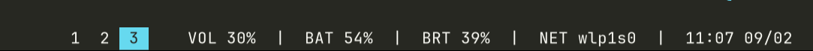

# figbar

A minimal, duo-tone status bar for Wayland compositors with native fractional scaling support. Forked from [ergo](https://github.com/pubfnmain/ergo).

## Dependencies

- wayland
- cairo
- pango
- wayland-protocols

## Usage

Use stdin to pass text for display.
Use `^` to highlight text (can be escaped with a backslash `\^`).

### Interactive Click Events

Items can specify an optional identifier using `[[key]]` syntax at the start of any segment (e.g. `[[vol]] 50%` or `[[ws_1]] [1]`). The `[[key]]` tag is hidden from rendering.

When a user clicks on an item, `figbar` emits a JSON line to stdout in real-time:

```json
{"event":"click","key":"vol","index":0,"button":1}
```

- `key`: The identifier defined in `[[...]]`, or `null` if omitted.
- `index`: 0-based index of the item segment across the bar.
- `button`: Mouse button (1 = Left, 2 = Middle, 3 = Right, 4 = Side, 5 = Extra).

### Examples

```sh
while true; do echo "[[time]] $(date +%R)"; sleep 5; done | figbar -rN '3f3f3f'
```

```sh
echo "[[left]] some ^[[mid]] awesome ^[[right]] text " | figbar
```

Handling clicks in a shell loop:

```sh
figbar < input_pipe | while read -r event; do
    # event: {"event":"click","key":"vol","index":0,"button":1}
    key=$(echo "$event" | jq -r .key)
    case "$key" in
        vol) pamixer -t ;; # toggle mute
        *) ;;
    esac
done
```

### Sway Status Bar



A complete status generator for Sway is included in [`ex/sway_status.py`](ex/sway_status.py). It displays:
- Active and inactive Sway workspaces (highlighting the focused workspace with `^`)
- Audio volume & mute status (via `pamixer`)
- Battery level & charging indicator (`/sys/class/power_supply`)
- Screen brightness (via `brightnessctl`)
- Network SSID or Ethernet interface (`ip`, `iw`)
- Time and date

It also handles interactive clicks to switch workspaces, toggle audio mute or adjust volume, and control brightness.

Run it with customized font and colors:

```sh
python3 ex/sway_status.py | figbar -b -r \
  -f "JetBrainsMono Nerd Font 10.5" \
  -N 272822 -n f8f8f2 \
  -S 66d9ef -s 272822
```

Or bidirectional (sending clicks back to `sway_status.py`):

```sh
python3 ex/sway_status.py --listen
```

Flags used above:
- `-b`: Anchor bar to bottom (default: top)
- `-r`: Right-align status text (default: left)
- `-f`: Font family and size (Pango format)
- `-N` / `-n`: Normal background / foreground colors (hex)
- `-S` / `-s`: Selected (highlighted) background / foreground colors (hex)

## Thanks

- [ergo](https://github.com/pubfnmain/ergo) - original codebase
- [Wayland Book](https://wayland-book.com) - codebase reference
- [wmenu](https://sr.ht/~adnano/wmenu) - code examples (layer-shell, cairo, etc.)

